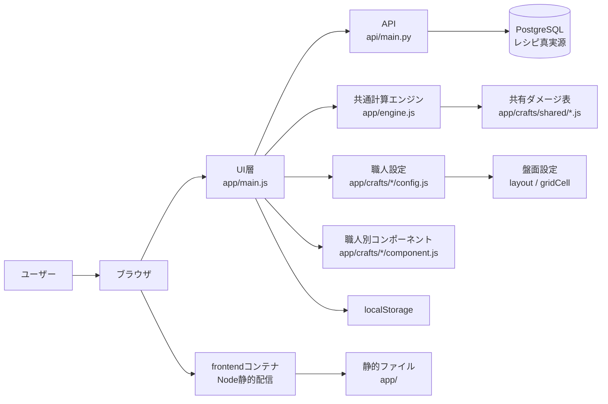
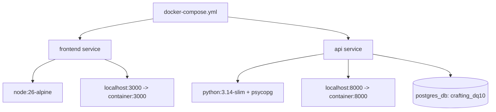

# 全体設計

## 概要

本アプリは、DQ10の職人ミニゲームを手入力または将来の画面認識で補助するWebアプリです。

現在は `frontend` と `api` の2コンテナで起動します。
フロントは静的ファイルを配信し、APIは職人データやPostgreSQLから復元したレシピを返します。

## 構成図

## レイヤー

### UI層

担当:

- 職人選択
- 入力フォーム表示
- 表示ラベル切替
- 職人ごとの盤面表示
- 職人ごとのレシピ選択
- レシピリストからのユーザー追加・削除
- 職人別コンポーネントへの描画差分委譲
- 結果表示
- localStorage保存

主なファイル:

- `app/index.html`
- `app/main.js`
- `app/styles.css`
- `frontend/server.js`

### API層

担当:

- ヘルスチェック
- 職人一覧のJSON返却
- 職人別レシピの返却
- CORSヘッダ付与

主なファイル:

- `api/main.py`
- `api/data/catalog.json`
- `api/repository/postgres_store.py`

### 計算エンジン層

担当:

- 現在値と成功範囲の差分計算
- 通常後、会心後の範囲計算
- 確定会心判定
- 超過リスク判定
- 候補手スコア計算

主なファイル:

- `app/engine.js`

### 職人設定層

担当:

- 共通設定と個別設定の分類
- 共通設定: 集中力、状態候補、盤面サイズ、基準値モード
- 個別設定: 職人名、表示ラベル、大項目、特性、特技、初期マス
- 共有ダメージ表への参照ID
- 職人固有のBOARD補助表示
- 職人固有の盤面編集可否

主なファイル:

- `app/crafts/registry.js`
- `app/crafts/shared/smithing-component.js`
- `app/crafts/<職人>/component.js`
- `app/crafts/<職人>/config.js`

武器鍛冶、防具鍛冶、道具鍛冶は `shared/smithing-component.js` を共用し、レシピと職人固有の特技・初期マスを各職人配下に置きます。
鍛冶の温度操作、温度別ダメージ表、光地金の有効温度判定は `shared/smithing-component.js` の責務です。
`main.js` はイベントの受け口と画面全体の再描画順序だけを扱い、鍛冶固有の描画内容はコンポーネントへ委譲します。
調理、裁縫、木工は職人別の `component.js` を持ち、盤面表示や職人固有操作を必要に応じて分離します。
`registerDQ10Craft()` は設定登録時に `settingGroups.common`、`settingGroups.individual`、`settingGroups.unknown` を付与します。
新しい設定キーを追加する場合は `app/crafts/registry.js` の分類スキーマも更新します。

### レシピ設定層

担当:

- 主要レシピの一覧
- レシピごとの初期マス
- レシピごとの成功範囲

主なファイル:

- PostgreSQL
- `api/migrations/0004_seed_recipes.sql`
- `app/crafts/<職人>/recipes.js`

PostgreSQLがレシピの真実源です。`0004_seed_recipes.sql` は空のDBを初期化する唯一のレシピ入力で、
`api/data/crafts/<職人>/recipes.json` はDBからの追跡対象外の生成物です。
`app/crafts/<職人>/recipes.js` はAPIが使えない場合のコミット対象フォールバックです。

### 共有ダメージ表

担当:

- 調理の位置別ダメージ
- 鍛冶系の温度別ダメージ
- 裁縫のぬいパワー別ダメージと参考確率
- 木工の木目別ダメージ

主なファイル:

- `app/crafts/shared/cooking-damage.js`
- `app/crafts/shared/smithing-damage.js`
- `app/crafts/shared/sewing-damage.js`
- `app/crafts/shared/woodworking-damage.js`

## データの流れ

1. ブラウザが `frontend` から静的ファイルを読み込みます。
2. 起動時に職人設定ファイルと職人別コンポーネントを読み込みます。
3. `main.js` がAPIから職人別レシピデータを取得します。
4. APIが使えない場合はローカルの `recipes.js` を使います。
5. `main.js` が選択中の職人設定から初期状態を作ります。
6. ユーザー入力を状態に反映します。
7. 料理名選択時はAPI由来の `items` でマス一覧を置き換えます。
8. `main.js` が `layout` と `gridCell` から盤面を描画し、職人固有の表示差分をコンポーネントへ委譲します。
9. `engine.js` が職人設定と共有ダメージ表から特技範囲を解決します。
10. `engine.js` が状態を評価します。
11. UIへ判定結果と候補手を表示します。
12. 状態は `localStorage` に保存します。

## コンテナ構成

APIのベースイメージは、PostgreSQLドライバのバイナリwheelを利用するため `slim` です。
接続先は既存の `postgres_db` コンテナで、`database_default` ネットワークを外部参照します
([レシピDB移行設計](./08-recipe-db-migration.md))。

## 保守方針

- 職人ごとの数値は `app/crafts/<職人>/config.js` に閉じ込めます。
- 調理の位置別ダメージは `app/crafts/shared/cooking-damage.js` に閉じ込めます。
- 鍛冶系の温度別ダメージは `app/crafts/shared/smithing-damage.js` に閉じ込めます。
- 裁縫と木工の基礎ダメージも `app/crafts/shared/` に閉じ込めます。
- 職人固有の画面差分は `app/crafts/<職人>/component.js` に閉じ込めます。
- 武器鍛冶、防具鍛冶、道具鍛冶の共通画面差分は `app/crafts/shared/smithing-component.js` に閉じ込めます。
- 共通判定は `app/engine.js` に集約します。
- UI文言はできるだけ職人設定から渡します。
- 盤面サイズとマス位置は職人設定から渡します。
- レシピ別の基準値と成功範囲はPostgreSQLで管理します。
- 空のDBの初期化は `api/migrations/0004_seed_recipes.sql`、API停止時はコミット対象の `recipes.js` を使います。
- 職人固有の計算が必要になったら、共通エンジンを拡張または職人別エンジンを追加します。
