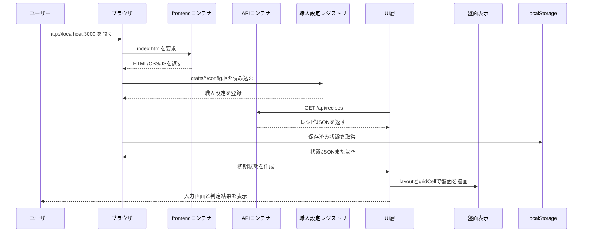
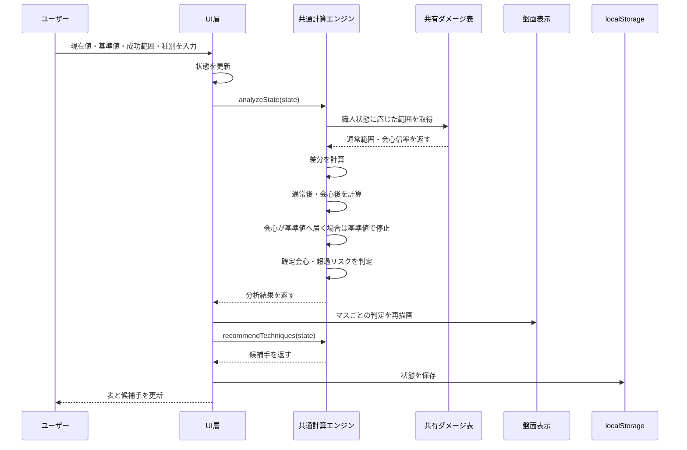
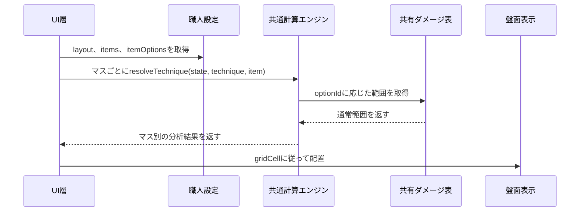
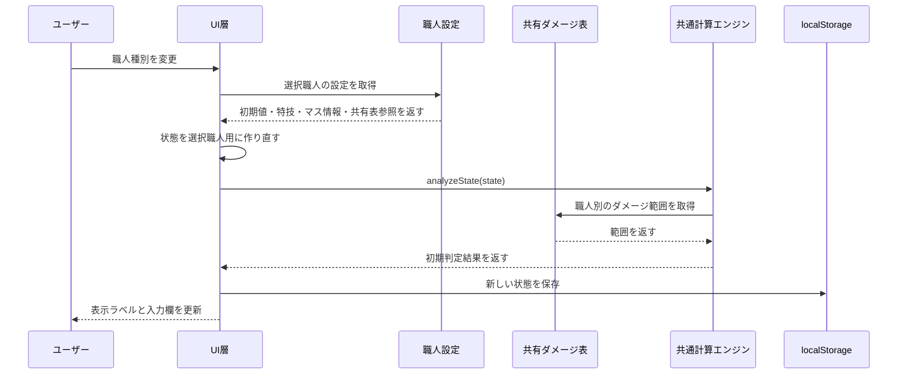
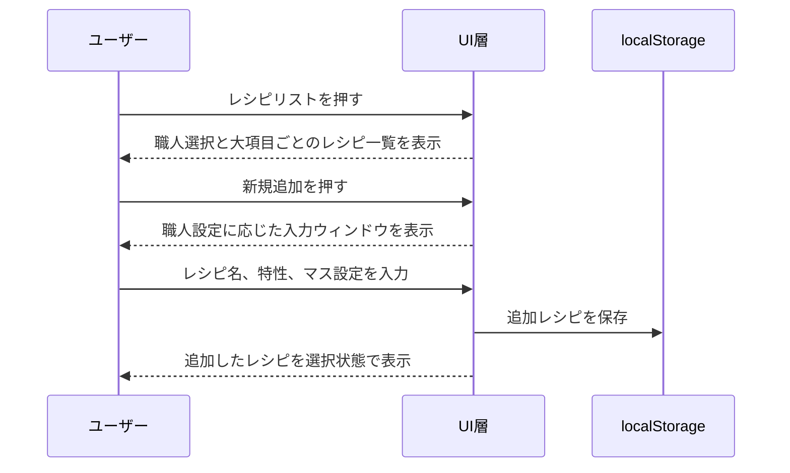
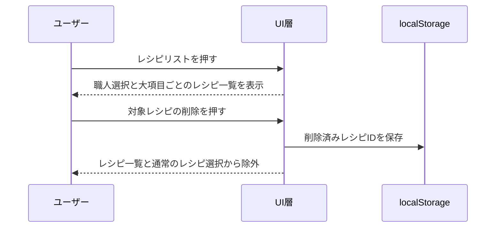
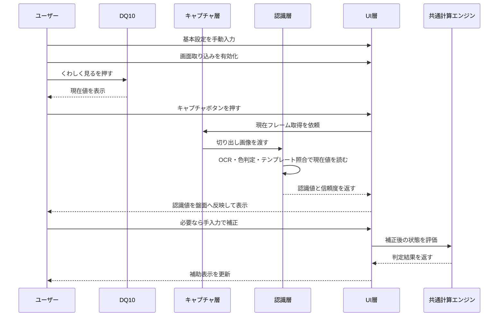

# シーケンス図

## アプリ起動

```mermaid
sequenceDiagram
  participant User as ユーザー
  participant Browser as ブラウザ
  participant Frontend as frontendコンテナ
  participant API as APIコンテナ
  participant Registry as 職人設定レジストリ
  participant UI as UI層
  participant Board as 盤面表示
  participant Storage as localStorage

  User->>Browser: http://localhost:3000 を開く
  Browser->>Frontend: index.htmlを要求
  Frontend-->>Browser: HTML/CSS/JSを返す
  Browser->>Registry: crafts/*/config.jsを読み込む
  Registry-->>Browser: 職人設定を登録
  UI->>API: GET /api/recipes
  API-->>UI: レシピJSONを返す
  Browser->>Storage: 保存済み状態を取得
  Storage-->>Browser: 状態JSONまたは空
  Browser->>UI: 初期状態を作成
  UI->>Board: layoutとgridCellで盤面を描画
  UI-->>User: 入力画面と判定結果を表示
```

## 手入力から判定表示まで

```mermaid
sequenceDiagram
  participant User as ユーザー
  participant UI as UI層
  participant Engine as 共通計算エンジン
  participant Damage as 共有ダメージ表
  participant Board as 盤面表示
  participant Storage as localStorage

  User->>UI: 現在値・基準値・成功範囲・種別を入力
  UI->>UI: 状態を更新
  UI->>Engine: analyzeState(state)
  Engine->>Damage: 職人状態に応じた範囲を取得
  Damage-->>Engine: 通常範囲・会心倍率を返す
  Engine->>Engine: 差分を計算
  Engine->>Engine: 通常後・会心後を計算
  Engine->>Engine: 会心が基準値へ届く場合は基準値で停止
  Engine->>Engine: 確定会心・超過リスクを判定
  Engine-->>UI: 分析結果を返す
  UI->>Board: マスごとの判定を再描画
  UI->>Engine: recommendTechniques(state)
  Engine-->>UI: 候補手を返す
  UI->>Storage: 状態を保存
  UI-->>User: 表と候補手を更新
```

## 盤面表示とマス別計算

```mermaid
sequenceDiagram
  participant UI as UI層
  participant Config as 職人設定
  participant Engine as 共通計算エンジン
  participant Damage as 共有ダメージ表
  participant Board as 盤面表示

  UI->>Config: layout、items、itemOptionsを取得
  UI->>Engine: マスごとにresolveTechnique(state, technique, item)
  Engine->>Damage: optionIdに応じた範囲を取得
  Damage-->>Engine: 通常範囲を返す
  Engine-->>UI: マス別の分析結果を返す
  UI->>Board: gridCellに従って配置
```

## 職人切替

```mermaid
sequenceDiagram
  participant User as ユーザー
  participant UI as UI層
  participant Config as 職人設定
  participant Damage as 共有ダメージ表
  participant Engine as 共通計算エンジン
  participant Storage as localStorage

  User->>UI: 職人種別を変更
  UI->>Config: 選択職人の設定を取得
  Config-->>UI: 初期値・特技・マス情報・共有表参照を返す
  UI->>UI: 状態を選択職人用に作り直す
  UI->>Engine: analyzeState(state)
  Engine->>Damage: 職人別のダメージ範囲を取得
  Damage-->>Engine: 範囲を返す
  Engine-->>UI: 初期判定結果を返す
  UI->>Storage: 新しい状態を保存
  UI-->>User: 表示ラベルと入力欄を更新
```

## レシピ追加

```mermaid
sequenceDiagram
  participant User as ユーザー
  participant UI as UI層
  participant Storage as localStorage

  User->>UI: レシピリストを押す
  UI-->>User: 職人選択と大項目ごとのレシピ一覧を表示
  User->>UI: 新規追加を押す
  UI-->>User: 職人設定に応じた入力ウィンドウを表示
  User->>UI: レシピ名、特性、マス設定を入力
  UI->>Storage: 追加レシピを保存
  UI-->>User: 追加したレシピを選択状態で表示
```

## レシピ削除

```mermaid
sequenceDiagram
  participant User as ユーザー
  participant UI as UI層
  participant Storage as localStorage

  User->>UI: レシピリストを押す
  UI-->>User: 職人選択と大項目ごとのレシピ一覧を表示
  User->>UI: 対象レシピの削除を押す
  UI->>Storage: 削除済みレシピIDを保存
  UI-->>User: レシピ一覧と通常のレシピ選択から除外
```

## 将来の画面認識

```mermaid
sequenceDiagram
  participant User as ユーザー
  participant Game as DQ10
  participant Capture as キャプチャ層
  participant Recognition as 認識層
  participant UI as UI層
  participant Engine as 共通計算エンジン

  User->>UI: 基本設定を手動入力
  User->>UI: 画面取り込みを有効化
  User->>Game: くわしく見るを押す
  Game-->>User: 現在値を表示
  User->>UI: キャプチャボタンを押す
  UI->>Capture: 現在フレーム取得を依頼
  Capture->>Recognition: 切り出し画像を渡す
  Recognition->>Recognition: OCR・色判定・テンプレート照合で現在値を読む
  Recognition-->>UI: 認識値と信頼度を返す
  UI-->>User: 認識値を盤面へ反映して表示
  User->>UI: 必要なら手入力で補正
  UI->>Engine: 補正後の状態を評価
  Engine-->>UI: 判定結果を返す
  UI-->>User: 補助表示を更新
```
