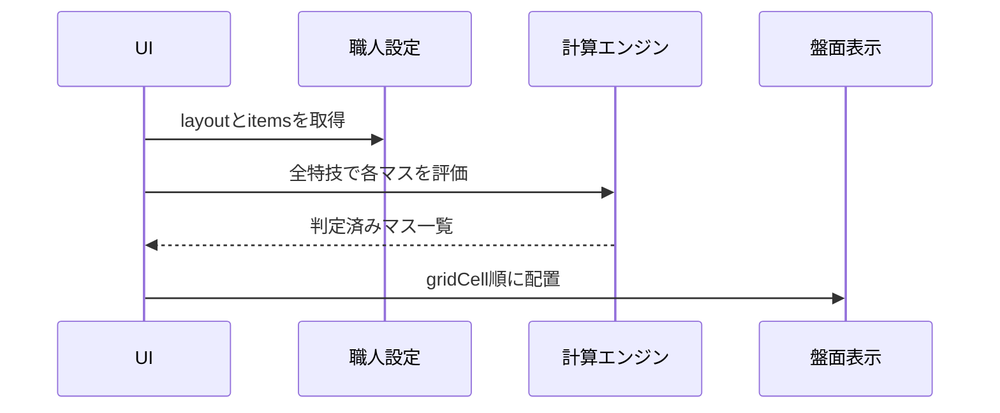

# 盤面表示設計

## 目的

職人ごとに異なるマスの形を、同じ画面モデルで表示します。

入力は従来どおり一覧表で行い、盤面は配置と状態を確認するための表示として扱います。

## 職人別の最大サイズ

| 職人 | 最大サイズ | 配置の考え方 |
| --- | --- | --- |
| 鍛冶系 | 横2×縦4 | 素材の向きは固定。品目ごとに使用マスだけ配置する |
| 裁縫 | 横3×縦3 | 素材の向きは固定。品目ごとに使用マスだけ配置する |
| 調理 | 横3×縦3固定 | 場所により中央、上下左右、四隅のダメージを切り替える |
| 木工 | 横3×縦3固定 | マスごとの木目方向により順目、逆目のダメージを切り替える |

## 設定モデル

職人設定に `layout` を追加します。

```js
layout: {
  label: "フライパン配置",
  columns: 3,
  rows: 3,
  fixed: true
}
```

各マスには `gridCell` を設定します。

```js
{
  id: "slot-5",
  name: "中央",
  optionId: "center",
  gridCell: { row: 2, column: 2 },
  current: 0,
  successMin: 60,
  successMax: 75
}
```

`row` と `column` は1始まりです。

`rowSpan` と `columnSpan` を追加すると、将来の大きなマスにも対応できます。

特技カードの代表値が必要な場合は `techniquePreviewOptionId` を設定します。

調理は中央、木工は並行を代表値として表示します。

## 調理の扱い

調理は3×3固定です。

`optionId` は場所を表します。

| `optionId` | 表示 | ダメージ表 |
| --- | --- | --- |
| `center` | 中央 | 中央の表 |
| `cross` | 上下左右 | 上下左右の表 |
| `corner` | 四隅 | 四隅の表 |

同じ特技でも、マスの `optionId` によって通常後、会心後の範囲が変わります。

## 鍛冶BOARD

鍛冶系では、BOARDの鍛冶配置の後に温度別ダメージ表を表示します。

- 現在温度は `-50℃`、`+50℃` のBOARD内操作で変更できます。
- 表示するダメージ表は、現在温度に対応する威力別の最小値、最大値、最大ダメージ、会心時の最低ダメージです。
- 温度別ダメージの下に、JSON登録した鍛冶特技の消費集中、特技名、倍率、範囲を表示します。
- BOARD内操作で変更した温度は、基本設定の温度選択にも反映します。

フライパン配置のマスを右クリックすると、現在値、固定状態、レシピ特性に応じた光・戻り状態を直接編集できます。
固定状態は現在値が基準範囲内のときだけ指定できます。
編集枠の外側を押した場合も、`更新` と同じく入力内容を反映します。

レシピ特性が `光` の場合はマスごとの光状態を指定します。

レシピ特性が `光・戻り` の場合は、上下左右が光る状態と四隅が戻る状態を切り替えます。

## 木工の扱い

木工は3×3固定です。

`optionId` は木目方向を表します。

| `optionId` | 画面表示 | 内部データ |
| --- | --- | --- |
| `parallel` | 並行 | 順目 |
| `vertical` | 垂直 | 逆目 |

木工の計算では、画面全体の状態ではなく、各マスの `optionId` を参照します。

## 表示フロー



## 画面上の役割

盤面:

- 職人ごとの形を視覚的に確認する
- 現在値、成功範囲、判定を表示する
- クリックすると該当行の現在値入力へ移動する

一覧表:

- マス名を入力する
- 調理の場所、木工の木目を選択する
- 現在値と成功範囲を入力する
- 詳細な判定結果を確認する

レシピ追加:

- 鍛冶職人は鍛冶配置と同じ2列×4行で入力する
- 鍛冶職人は各セルの基準範囲下限と上限だけを入力する
- 鍛冶職人はマス名を入力せず、レシピに含まれるマスだけを表示する
- 鍛冶職人はマス追加ボタンを表示しない

## 保守ルール

- 盤面サイズは `layout` に定義します。
- マス位置は各 `items` の `gridCell` に定義します。
- 調理の場所と木工の木目は `optionId` に定義します。
- 固定配置の鍛冶、裁縫も `gridCell` を持たせます。
- UI側に職人固有の座標を直書きしません。

固定盤面は `layoutSignature` を保存状態に含めます。

設定の盤面サイズやマス数が変わった場合は、古い保存状態より新しい `items` を優先します。

## 変更時の確認項目

1. `layout.rows` と `layout.columns` が最大サイズに合っていること。
2. `gridCell.row` と `gridCell.column` が範囲内であること。
3. 調理の `optionId` が `center`、`cross`、`corner` のいずれかであること。
4. 木工の `optionId` が `parallel`、`vertical` のいずれかであること。
5. 盤面と一覧表で同じマス数が表示されること。
