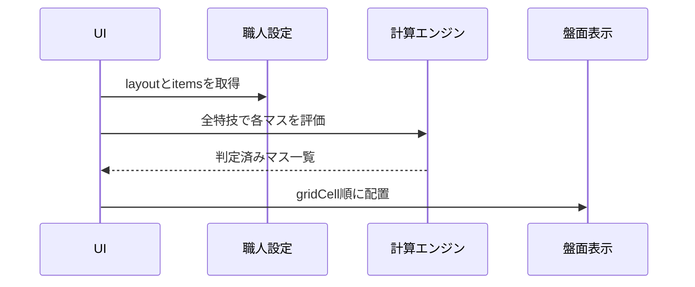

# 盤面表示設計

## 目的

職人ごとに異なるマスの形を、同じ画面モデルで表示します。

入力は従来どおり一覧表で行い、盤面は配置と状態を確認するための表示として扱います。

## 職人別の最大サイズ

| 職人 | 最大サイズ | 配置の考え方 |
| --- | --- | --- |
| 鍛冶系 | 横2×縦4 | 素材の向きは固定。品目ごとに使用マスだけ配置する |
| 裁縫 | 横3×縦3 | 素材の向きは固定。品目ごとに使用マスだけ配置する |
| 調理 | 横3×縦3固定 | 場所により中央、上下左右、四隅のダメージを切り替える |
| 木工 | 横3×縦3固定 | マスごとの木目方向により順目、逆目のダメージを切り替える |

## 設定モデル

職人設定に `layout` を追加します。

```js
layout: {
  label: "フライパン配置",
  columns: 3,
  rows: 3,
  fixed: true
}
```

各マスには `gridCell` を設定します。

```js
{
  id: "slot-5",
  name: "E",
  optionId: "center",
  gridCell: { row: 2, column: 2 },
  current: 0,
  successMin: 60,
  successMax: 75
}
```

`row` と `column` は1始まりです。
`name` は原則として空白セルも含めて左上から右方向へA/B/C...と割り当てます。
鍛冶系（武器鍛冶、防具鍛冶、道具鍛冶）は、レシピが使用する占有マスだけを読み順（行→列）に並べてA/B/C...と割り当て、単一列レシピがA/C/Eのように飛び番にならないようにします。

`rowSpan` と `columnSpan` を追加すると、将来の大きなマスにも対応できます。

特技カードの代表値が必要な場合は `techniquePreviewOptionId` を設定します。

調理は中央、木工は横を代表値として表示します。

## 調理の扱い

調理は3×3固定です。

`optionId` は場所を表します。

| `optionId` | 表示 | ダメージ表 |
| --- | --- | --- |
| `center` | 中央 | 中央の表 |
| `cross` | 上下左右 | 上下左右の表 |
| `corner` | 四隅 | 四隅の表 |

同じ特技でも、マスの `optionId` によって通常後、会心後の範囲が変わります。

## 鍛冶BOARD

鍛冶系では、BOARDの鍛冶配置の後に温度別ダメージ表を表示します。

- 現在温度はBOARD上部の温度欄にある `-200℃`、`-50℃`、温度プルダウン、`+50℃`、`+200℃` 操作で変更できます。初期値は `1600℃` です。
- 表示するダメージ表は、現在温度に対応する威力別の最小値、最大値、最大ダメージ、会心時の最低ダメージです。倍率は低い順に表示し、倍半の発動温度では半減または倍加を反映します。
- BOARD内操作で変更した温度は、基本設定の温度選択にも反映します。

特性が `倍半` または `集中変化` の場合、温度別ダメージ表の下に200℃ごとの会心確定ラインを表示します。

- 200℃単位の温度(200℃〜2000℃)ごとに、威力別の「残り◯以下で会心確定」(会心最小値)を一覧表示します。
- `倍半` は温度ごとの威力補正(半減・倍加)を反映した値、`集中変化` はダメージ自体は変化しないため通常時と同じ会心最小値を表示します。
- 特性がそれ以外の場合は非表示にします(特性選択は基本設定の変更のため、表示領域は確保しません)。

鍛冶配置のマスを右クリックすると、現在値と確定済み状態を直接編集できます。確定済みは成功範囲内の値だけ指定できます。
BOARDセルの判定は1倍相当で表示し、各ノードの基準表示は基準値のみを表示します。光地金の光選択はノード上でも切り替えられます。鍛冶では調理向けの固定文言を表示せず、確定済み、本会心！、通常時超過リスクなしで非会心ダメージが基準値へ届く場合のゲージ突入を表示します。BOARD上部には現在状態欄を常に確保し、200℃単位で特性が発動している場合は光地金、倍加、半減、集中半減、集中増加を、未発動の場合は通常状態を表示します。温度変更だけでBOARDや操作ボタンの位置が上下に動かないよう、この領域は折りたたみません。戻りは200n+50℃で次が戻りターンであることを表示し、戻り値は手動入力します。
鍛冶BOARD上部の必殺行には `ヘパイトスの火種` を表示します。必殺状態は `未チャージ`、`チャージ済み`、`使用中`、`使用済み` の4段階で、`使用中` の場合はBOARD判定を会心範囲として表示します。
光地金の有効化や解除でノードサイズが変わらないよう、鍛冶BOARDセルは光切替用の表示行とヘッダーの光バッジ領域を常に確保します。
編集枠の外側を押した場合も、`更新` と同じく入力内容を反映します。

レシピ特性が `光` の場合はマスごとの光状態を指定します。

レシピ特性が `光・戻り` の場合は、上下左右が光る状態と四隅が戻る状態を切り替えます。

## 木工の扱い

木工は3×3固定です。

`optionId` は木目方向を表します。

| `optionId` | 画面表示 | 内部データ | 木目 |
| --- | --- | --- | --- |
| `horizontal` | 横 | 横木目 | 順目 |
| `vertical` | 縦 | 縦木目 | 逆目 |

木工の計算では、画面全体の状態ではなく、各マスの `optionId` を参照します。

各マスの背景には木目を直感的に区別するパターンを描きます。順目は縦ストライプ、逆目は横ボーダーで表示します。加えて、鍛冶の光バッジと同様に、マス名称の下へ順目／逆目を背景色付きの文字列として表示します。

BOARD上部の `左90°`、`右90°` は木材を90度回転した時の盤面変更として扱い、右90°では上にあるマスが右へ移るように各マスの座標を回転します。回転すると木材の向きが変わるため、位置の変換に加えて、すべてのマスの木目（順目／逆目）が横↔縦で反転します。

## 表示フロー



## 画面上の役割

盤面:

- 職人ごとの形を視覚的に確認する
- 現在値、成功範囲、判定を表示する
- クリックすると該当行の現在値入力へ移動する

一覧表:

- マス名を入力する
- 調理の場所、木工の木目を選択する
- 現在値と成功範囲を入力する
- 詳細な判定結果を確認する

レシピ追加:

- 鍛冶職人は鍛冶配置と同じ2列×4行で入力する
- 鍛冶職人は各セルの基準範囲下限と上限だけを入力する
- 鍛冶職人はマス名を入力せず、レシピに含まれるマスだけを表示し、表示対象の読み順でA/B/C...を採番する
- 鍛冶職人はマス追加ボタンを表示しない

## 保守ルール

- 盤面サイズは `layout` に定義します。
- マス位置は各 `items` の `gridCell` に定義します。
- 調理の場所と木工の木目は `optionId` に定義します。
- 固定配置の鍛冶、裁縫も `gridCell` を持たせます。
- UI側に職人固有の座標を直書きしません。

固定盤面は `layoutSignature` を保存状態に含めます。

設定の盤面サイズやマス数が変わった場合は、古い保存状態より新しい `items` を優先します。

## 変更時の確認項目

1. `layout.rows` と `layout.columns` が最大サイズに合っていること。
2. `gridCell.row` と `gridCell.column` が範囲内であること。
3. 調理の `optionId` が `center`、`cross`、`corner` のいずれかであること。
4. 木工の `optionId` が `horizontal`、`vertical` のいずれかであること。
5. 盤面と一覧表で同じマス数が表示されること。
