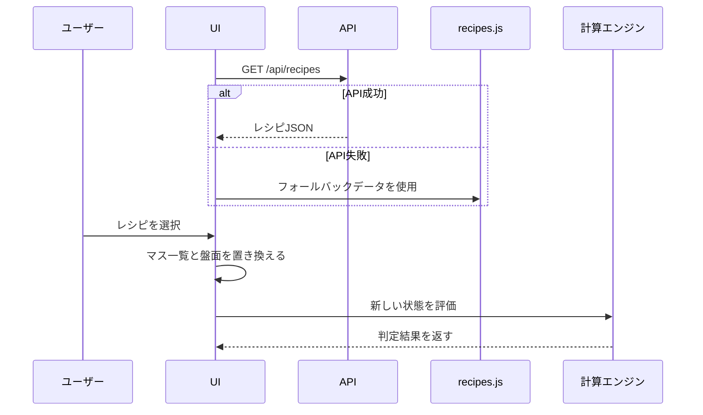

# レシピデータ設計

## 目的

主要なレシピの基準値と成功範囲をPostgreSQLで管理します。

画面側はレシピを選ぶだけで、マス名、配置、基準値、成功下限、成功上限を読み込みます。

## ファイル配置

DB初期化と生成物:

```text
api/migrations/0004_seed_recipes.sql
api/data/crafts/<職人>/recipes.json
```

フロント側:

```text
app/crafts/<職人>/recipes.js
```

PostgreSQLが真実源で、`0004_seed_recipes.sql` は空のDBを初期化する唯一のレシピ入力です。
`api/data/crafts/<職人>/recipes.json` は `export_recipes.py` の追跡対象外の生成物です。
フロント側の `recipes.js` は、APIが使えない場合のコミット対象フォールバックです。

## API

| API | 用途 |
| --- | --- |
| `GET /health` | API起動確認 |
| `GET /api/crafts` | 職人一覧 |
| `GET /api/recipes` | 全職人のレシピ一覧 |
| `GET /api/crafts/{craftId}/recipes` | 指定職人のレシピ一覧 |
| `GET /api/crafts/{craftId}/masters` | 指定職人の分類・特性・食材マスタ一覧 ([マスタ参照API](./14-recipe-master-api.md)) |
| `PUT /api/crafts/{craftId}/recipes/{recipeId}` | レシピ追加・編集内容をPostgreSQLへ反映 |
| `DELETE /api/crafts/{craftId}/recipes/{recipeId}` | レシピ削除内容をPostgreSQLへ反映 |

## JSON形式

```json
[
  {
    "id": "cooking-3x3-standard",
    "name": "9マス料理テンプレート",
    "traitId": "light",
    "items": [
      {
        "id": "slot-5",
        "name": "E",
        "optionId": "center",
        "gridCell": { "row": 2, "column": 2 },
        "current": 0,
        "target": 68,
        "successMin": 60,
        "successMax": 75
      }
    ]
  }
]
```

## 項目の意味

| 項目 | 意味 |
| --- | --- |
| `id` | レシピまたはマスの内部ID |
| `name` | 盤面上の位置名。原則は空白セルを含む左上からの座標順、鍛冶系は占有マスだけの読み順でA/B/C...と数える |
| `archived` | `true` の場合、データは保持するがレシピ選択に表示しない |
| `traitId` | 調理レシピの特性 |
| `items` | レシピに含まれるマス一覧 |
| `optionId` | 調理の場所、木工の木目 |
| `gridCell` | 盤面上の位置 |
| `current` | 初期現在値 |
| `target` | 固定基準値職人で、会心発生時に止まる誤差0の基準値 |
| `successMin` | 成功範囲の下限 |
| `successMax` | 成功範囲の上限 |
| `ingredientGroupId` | 調理で同時に移動する食材グループID |
| `ingredientGroupLabel` | 食材グループの画面表示名 |
| `ingredientSize` | 同一食材グループのマス数 |

## 調理レシピの特性

調理職人では、レシピごとに4ターンごとの特性を `traitId` で管理します。

| ID | 意味 |
| --- | --- |
| `light` | 光 |
| `light-return` | 光・戻り |
| `recovery` | 回復 |

旧データ互換として、`none` は `light`、`return` は `recovery` に正規化します。
全レシピの実特性確認は GitHub issue #11 で追跡します。

詳細な挙動は [調理職人メモ](../crafts/cooking.md) を参照します。

## 鍛冶レシピの基準範囲

武器鍛冶、防具鍛冶、道具鍛冶では、調理職人と同じく `successMin` から `successMax` の範囲内で基準値がランダムに決まります。
計算では職人設定の `targetMode: "random-in-range"` を使い、会心停止も基準範囲内の到達可能値として扱います。

レシピ追加画面では、鍛冶配置どおりの2列×4行グリッドを表示します。
各セルの入力項目は基準範囲の下限と上限だけです。
マス名、行、列、固定基準値は入力せず、レシピが持つマスだけを実配置の位置へ表示します。
鍛冶職人ではマス追加ボタンを表示しません。
保存互換のため、ブラウザ追加レシピには `target` も中央値として保持しますが、鍛冶の判定には下限と上限を使います。
鍛冶系の `name` は、空白セルを含む座標順ではなく、レシピが使用する占有マスだけを読み順（行→列）に並べてA/B/C...と採番します。単一列の3マス構成はA/C/EではなくA/B/Cとして保存します。

## 木工・裁縫レシピの固定基準値

木工職人と裁縫職人では、基準範囲ではなく各マスに固定の基準値だけを持ちます。
レシピデータでは `target` を固定基準値として保存し、保存互換のため `successMin` と `successMax` も `target` と同じ値にします。
基準値にランダム性はありません。

レシピ追加画面では、レシピまたは職人設定が持つマスだけを実配置の位置へ表示します。
各セルの入力項目は基準値だけです。
木工では木目を `optionId` へ `horizontal` または `vertical` で保存し、レシピ入力欄では `位置` ではなく `木目` と表示します。
木工と裁縫の特性は未整理のため、現時点のレシピデータには `traitId` を設定しません。
木工・裁縫職人ではマス追加ボタンを表示しません。

BOARDでは基準値との差が `0` のマスを「基準値」、絶対差が `1` から `3` のマスを「基準値付近」と表示します。
BOARD内の「全体の誤差」は、全マスの `abs(target - current)` を合計した値です。
右クリックの威力別ダメージ判定では、各威力の非会心ダメージ分布に `target - current` と同じ値がある場合、その威力を「チャンス!」と表示します。

木工の大項目は `refarence/woodworking` 配下のPNGタイトルに合わせます。
現時点では、`スティック`、`杖`、`昆`、`扇`、`弓`、`釣り竿` を大項目テンプレートとして定義します。
`釣り竿` は列2に縦(逆目)3マス、列1に行2-3の2マスを並べた計5マス(B・D・E・G・H)構成です。
裁縫の大項目は `refarence/sewing` 配下のPNGタイトルに合わせます。
現時点では、`アタマ`、`からだ上`、`からだ下`、`ウデ`、`足` を大項目テンプレートとして定義します。
既存テンプレートレシピにも同じ `category` と `categoryId` を設定し、大項目選択時に表示できるようにします。

## 複数マス食材

調理職人には、1マス食材と2マス食材があります。

複数マス食材は、同一食材を構成するマスをグループとして扱います。
2マス食材として扱う種類は肉と魚だけです。
同じ `ingredientGroupId` を持つマスが3つ以上ある場合は、データ不整合として結合食材扱いにしません。

使用フィールド:

```json
{
  "ingredientGroupId": "meat-1",
  "ingredientGroupLabel": "肉",
  "ingredientSize": 2
}
```

肉または魚で、`ingredientGroupId` が同じマスがちょうど2つある場合、フライパン配置で移動、入れ替えを同時に行います。
調理レシピ編集では、食材分類をプルダウンから選びます。
肉は左右、魚は上下に隣り合う2マスを同じ分類にした場合だけ保存できます。
保存時は成立したペアへ `ingredientGroupId` と `ingredientSize: 2` を自動設定します。
入れ替え時はクリックした片方のマスではなく、グループ全体の左上位置を基準に上下または左右の並びをまとめて交換します。
BOARD表示上には初期座標、現在位置の種別、食材ノード左上の初期位置名を表示しません。
方向指定の入れ替えでは、隣が1マス食材で相手も1マス移動で収まる場合、結合食材が空けたマスへ相手を移して交換します。
移動先が空白のみ、または相手食材が1マス移動で入れ替われる場合は、結合食材の形を維持して移動します。
相手食材が2マス以上移動する必要がある配置では交換不可とします。
テンキー配置の `1,2` が肉、`3` が野菜の場合、肉を右へ動かすと野菜が左へ2マス移動するため交換不可です。
移動先に別の `ingredientGroupId` の一部だけが含まれる場合は、相手グループを分断しないため交換不可とします。
テンキー配置の `2,3` から上へ動く先が `5,6` で、`5` が `4,5` グループの一部、`6` が1マス食材の場合は交換不可です。
ブラウザ操作での代表ケース確認は GitHub issue #12 で追跡します。

レシピ実データへ追加する場合は [調理職人メモ](../crafts/cooking.md) と合わせて更新します。

## 調理食材画像

調理のフライパン配置は3x3の長方形グリッドとして表示します。
各マスでは、`ingredientGroupLabel` を食材画像のキーとして使います。
画像専用フィールドは持たず、レシピデータの食材分類を表示にも流用します。

対応する `ingredientGroupLabel`:

- `肉`
- `魚`
- `野菜`
- `麺`
- `卵`

`ingredientGroupLabel` が空の場合、表示側では食材画像を出しません。
レシピの `categoryId` や名前だけではマスごとの食材種別を断定できないため、カテゴリ単位の推定は行いません。

配置移動などでレシピが手入力扱いになった場合も、明示済みの `ingredientGroupLabel` は保持し、対応する画像を継続表示します。

分類できない場合は画像を表示せず、配置、現在値、基準値の表示を優先します。

盤面セルでは、画像、現在値、判定基準、判定ステータスを別行で表示します。
判定基準は中段左右を含む全マスで表示し、狭い画面でも非表示にしません。
縦長の食材画像はセル内の画像領域に収め、画像に含まれる隣接セルの端は表示側でクリップします。

## 調理光効果

`光` と `光・戻り` の表示状態は1ターン効果として保存します。
`光` は各食材の `isGlowing` で管理し、盤面セル内の光ボタンで各マスを切り替え、全解除操作で全マスを `false` にします。
`光・戻り` は `cookingEffectMode` で管理します。
1ターン効果のため、レシピ切替、特性切替、保存状態の読み込みでは `none` に戻します。
光効果の手動操作は盤面履歴に含め、Undo/Redoで直前の効果状態へ戻します。

| 値 | 意味 |
| --- | --- |
| `none` | 効果なし |
| `cross-glow` | 上下左右が光る |
| `corner-return` | 四隅が戻り |

## 調理火力状態

`強火焼き` と `弱火焼き` の4ターン継続状態は、既存の `heat` で管理します。
盤面上部の火力切替ボタンは基本設定の火力状態と同じ値を更新します。

| 値 | 意味 |
| --- | --- |
| `normal` | 通常 |
| `strong` | 強火焼き中 |
| `half` | 弱火焼き中 |

## 画面動作



## 会心停止

会心発生時は威力を2倍で計算し、その結果が基準値へ届く場合は、超過せず基準範囲内で止まるものとして判定します。
調理職人では現在火力を参照し、現在位置または光マスの位置別ダメージ最小値、最大値と、基準下限から基準上限までの範囲を比較して判定します。

例:

- 現在値: `60`
- 基準値: `68`
- 会心後の生範囲: `84 - 96`
- 表示上の会心後: `68 - 68`

## レシピ編集との関係

レシピ選択後に以下を変更しても、レシピ選択欄に「手入力」項目は表示しません。

- マス名（鍛冶系は占有マスの読み順で自動採番）
- 場所や木目
- 基準値
- 成功下限
- 成功上限
- マス追加
- マス削除

現在値だけを変更した場合は、選択中レシピを維持します。

全職人で、未登録レシピはレシピリストの追加機能から登録します。
大項目がある職人で対象大項目にレシピがない場合は、制作物選択欄に `未登録` を表示します。

## 保守ルール

- 実レシピの数値はPostgreSQLで管理します。
- UIや計算エンジンにレシピ名を直書きしません。
- 表示対象外だが履歴として残すレシピは削除せず、`archived: true` を付けます。
- 実数値の出典がある場合は、対象JSONと同じディレクトリにメモを追加します。
- 不明な実数値を断定しません。
- テンプレート値は、実レシピ値に置き換える前提で管理します。
- 道具鍛冶の大項目は `tool-smithing/config.js` の `recipeCategoryOptions` で管理し、具体的な制作物は画面のレシピ管理からDBへ追加します。
- 武器鍛冶の大項目は `weapon-smithing/config.js` の `recipeCategoryOptions` で管理し、具体的な制作物は画面のレシピ管理からDBへ追加します。
- 防具鍛冶の大項目は `armor-smithing/config.js` の `recipeCategoryOptions` で管理し、具体的な制作物は画面のレシピ管理からDBへ追加します。
- 道具鍛冶のテンプレートレシピは `archived: true` として非表示にし、実レシピを道具名の選択肢に表示します。
- レシピ追加・編集・削除はブラウザの `localStorage` に保存し、API起動時はPostgreSQLにも反映します。
- API停止時や反映失敗時はブラウザ保存を優先し、画面上では従来どおりユーザー追加レシピを利用します。
- 木工・裁縫のカテゴリ・テンプレート構造テストの正解は `tests/fixtures/<職人>-categories.json` に分離します。レシピの並び順や件数が変わってもテストが壊れないよう、テストは config と本番データがこの fixture へ適合するかのみを検証します。
