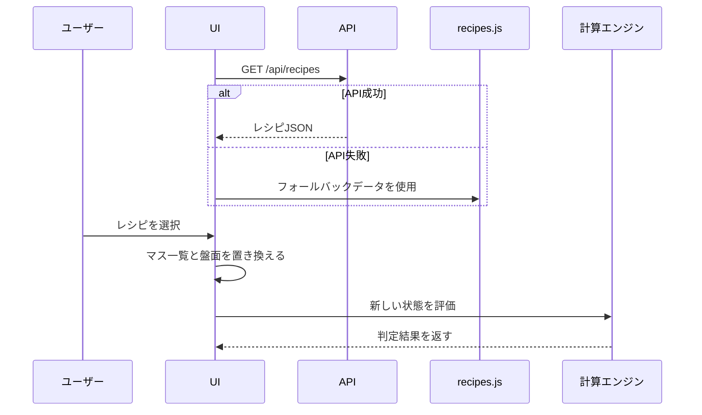

# レシピデータ設計

## 目的

主要なレシピの基準値と成功範囲を、職人ごとのJSONで管理します。

画面側はレシピを選ぶだけで、マス名、配置、基準値、成功下限、成功上限を読み込みます。

## ファイル配置

API側:

```text
api/data/
  catalog.json
  crafts/cooking/recipes.json
  crafts/weapon-smithing/recipes.json
  crafts/armor-smithing/recipes.json
  crafts/tool-smithing/recipes.json
  crafts/sewing/recipes.json
  crafts/woodworking/recipes.json
  crafts/lamp-alchemy/recipes.json
  crafts/pot-alchemy/recipes.json
```

フロント側:

```text
app/crafts/<職人>/recipes.js
```

フロント側の `recipes.js` は、APIが使えない場合のフォールバックです。

## API

| API | 用途 |
| --- | --- |
| `GET /health` | API起動確認 |
| `GET /api/crafts` | 職人一覧 |
| `GET /api/recipes` | 全職人のレシピ一覧 |
| `GET /api/crafts/{craftId}/recipes` | 指定職人のレシピ一覧 |

## JSON形式

```json
[
  {
    "id": "cooking-3x3-standard",
    "name": "9マス料理テンプレート",
    "recipeTrait": "glow",
    "items": [
      {
        "id": "slot-5",
        "name": "中央",
        "optionId": "center",
        "gridCell": { "row": 2, "column": 2 },
        "current": 0,
        "target": 68,
        "successMin": 60,
        "successMax": 75
      }
    ]
  }
]
```

## 項目の意味

| 項目 | 意味 |
| --- | --- |
| `id` | レシピまたはマスの内部ID |
| `name` | 画面表示名 |
| `recipeTrait` | 調理のレシピ特性。未指定時は `none` |
| `items` | レシピに含まれるマス一覧 |
| `optionId` | 調理の場所、木工の木目 |
| `gridCell` | 盤面上の位置 |
| `current` | 初期現在値 |
| `target` | 会心発生時に止まる誤差0の基準値 |
| `successMin` | 成功範囲の下限 |
| `successMax` | 成功範囲の上限 |

調理の `recipeTrait` は以下を使用します。

| 値 | 意味 |
| --- | --- |
| `none` | 特性なし |
| `glow` | マスごとに光状態を入力 |
| `glow-return` | 上下左右が光る状態、または四隅が戻る状態を選択 |

## 画面動作



## 会心停止

会心発生時に `target` へ届く場合は、超過せず `target` で止まるものとして判定します。

例:

- 現在値: `60`
- 基準値: `68`
- 会心後の生範囲: `84 - 96`
- 表示上の会心後: `68 - 68`

## 手入力との関係

レシピ選択後に以下を変更すると、レシピ選択は「手入力」扱いになります。

- マス名
- 場所や木目
- 基準値
- 成功下限
- 成功上限
- マス追加
- マス削除

現在値だけを変更した場合は、選択中レシピを維持します。

## 保守ルール

- 実レシピの数値は `api/data/crafts/<職人>/recipes.json` に記載します。
- UIや計算エンジンにレシピ名を直書きしません。
- 実数値の出典がある場合は、対象JSONと同じディレクトリにメモを追加します。
- 不明な実数値を断定しません。
- テンプレート値は、実レシピ値に置き換える前提で管理します。
