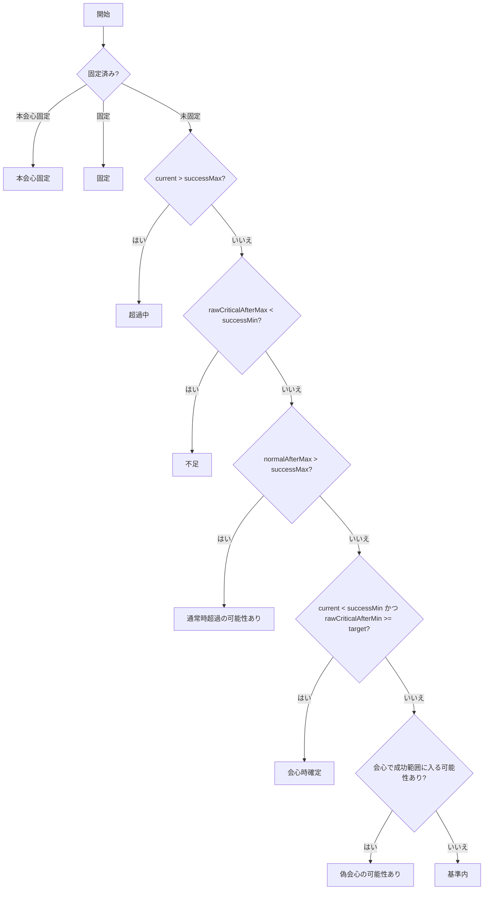
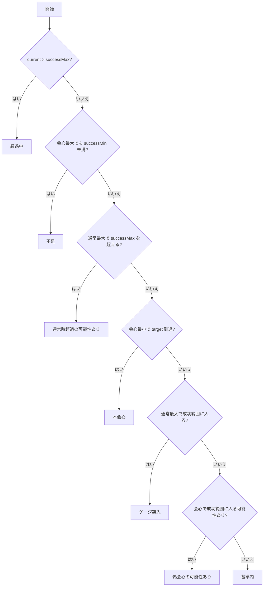
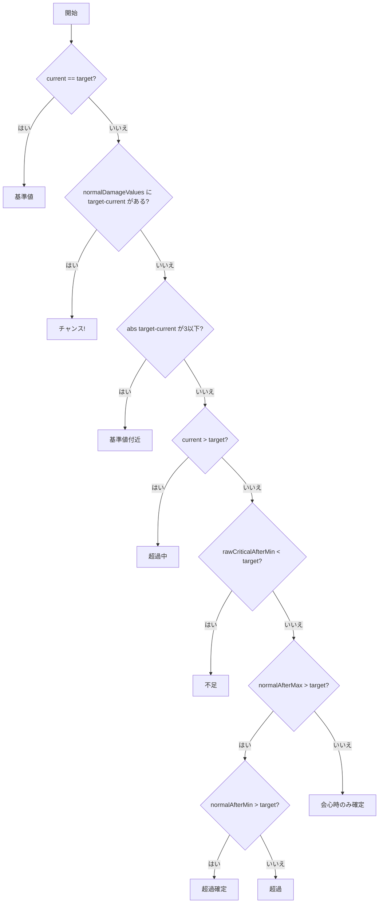

# 判定フロー

職人ごとの判定基準を整理します。
鍛冶系は武器鍛冶、防具鍛冶、道具鍛冶で同じ判定フローを使います。

## 共通用語

- `current`: 現在値
- `target`: 基準値
- `successMin`: 成功下限
- `successMax`: 成功上限
- `normalAfterMin`: 通常最小後の値
- `normalAfterMax`: 通常最大後の値
- `criticalAfterMin`: 会心停止反映後の会心最小後の値
- `criticalAfterMax`: 会心停止反映後の会心最大後の値
- `rawCriticalAfterMin`: 会心停止前の会心最小後の値
- `rawCriticalAfterMax`: 会心停止前の会心最大後の値
- `normalDamageValues`: 選択した威力で発生する非会心ダメージ値の集合

## 調理

調理は成功範囲と固定状態を持つ職人として判定します。
固定済みの食材はダメージ対象外です。

## 鍛冶系

鍛冶系は温度、地金特性、必殺状態を反映したダメージで判定します。
ヘパイトスの火種が使用中の場合は強制会心として扱います。

「本会心(会心時確定)」の場合は、右クリックメニュー(マス編集)で非会心時の結果を以下の3種類に補足表示します。

- `normalAfterMin >= successMin`: 非会心時基準範囲突入確定(通常ダメージでも必ず基準範囲へ入る)
- `normalAfterMax < successMin`: 非会心時不足(通常ダメージでは必ず基準範囲に届かない)
- 上記以外: 非会心時突入の可能性(通常ダメージの値によって入るかどうかが変わる)

## 裁縫

裁縫は成功範囲ではなく、基準値ちょうどを狙う固定基準値職人として判定します。
超過可能性、ゲージ突入、偽会心の可能性あり、基準内は使いません。

## 木工

木工は裁縫と同じ固定基準値判定を使います。
違いはダメージ範囲の参照元で、マスの木目に応じた木工ダメージ表から通常値と会心値を求めます。

